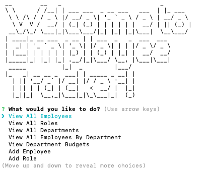
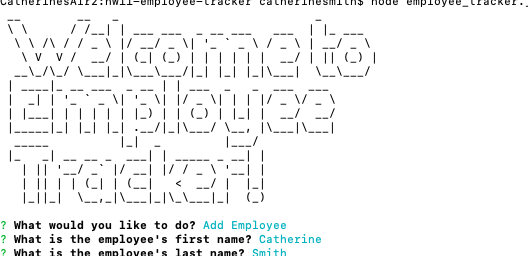

# Employee Tracker

## My Task

My assignment was to create a Content Management System (an interface that makes it easy for non-developers to view and interact with information stored in a database) to view and manage departments, roles, and employees of a company.


## Table of Contents
1. [Technologies Used](#Technologies-Used)
2. [User Story](#User-Story)
3. [Mock Up](#Mock-Up)
4. [Tests](#Tests)
5. [Usage](#Usage)
6. [Contact](#Contact)
7. [License](#License)


## Technologies Used
```
1. JavaScript
2. Express.js
3. Node.js
4. Inquirer.js
5. MySQL
6. Console.table
7. Figlet
```

## User Story

```
As a business owner,
I want to be able to view and manage the departments, roles, and employees in my company
So that I can organize and plan my business
```


## Mock-Up

The following image and video demonstrate the command-line application's appearance and functionality: 





The following video demonstrates the application's functionality':


The following link leads to the GitHub repository for this app:


## Tests
To run tests, enter the following in your command-line: npm run test

## Usage
To start enter: node employee-tracker.js
*Note: I have this as the start script in the package.json file, btu I cannot figure out why it won't work from the terminal as npm start.

## Contact
If you have any questions about the repo, contact me at [crsmith01](https://github.com/crsmith01).


## License
  [](https://opensource.org/licenses/MIT)
Copyright 2021 Catherine Smith

Permission is hereby granted, free of charge, to any person obtaining a copy of this software and associated documentation files (the "Software"), to deal in the Software without restriction, including without limitation the rights to use, copy, modify, merge, publish, distribute, sublicense, and/or sell copies of the Software, and to permit persons to whom the Software is furnished to do so, subject to the following conditions:

The above copyright notice and this permission notice shall be included in all copies or substantial portions of the Software.

THE SOFTWARE IS PROVIDED "AS IS", WITHOUT WARRANTY OF ANY KIND, EXPRESS OR IMPLIED, INCLUDING BUT NOT LIMITED TO THE WARRANTIES OF MERCHANTABILITY, FITNESS FOR A PARTICULAR PURPOSE AND NONINFRINGEMENT. IN NO EVENT SHALL THE AUTHORS OR COPYRIGHT HOLDERS BE LIABLE FOR ANY CLAIM, DAMAGES OR OTHER LIABILITY, WHETHER IN AN ACTION OF CONTRACT, TORT OR OTHERWISE, ARISING FROM, OUT OF OR IN CONNECTION WITH THE SOFTWARE OR THE USE OR OTHER DEALINGS IN THE SOFTWARE.